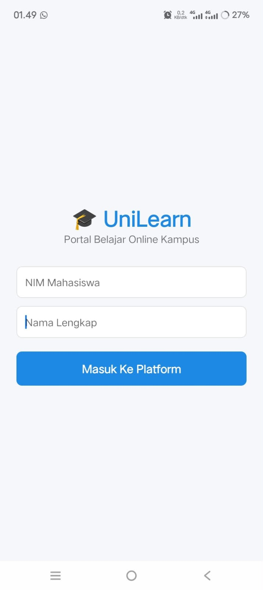
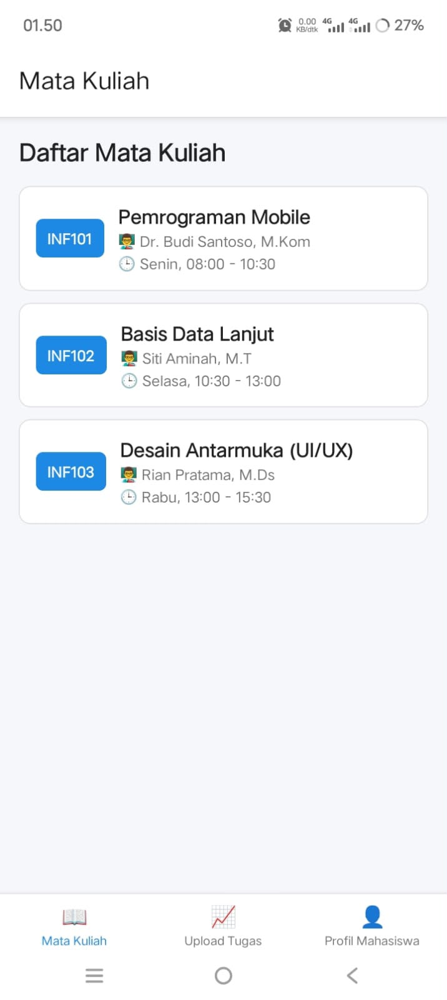
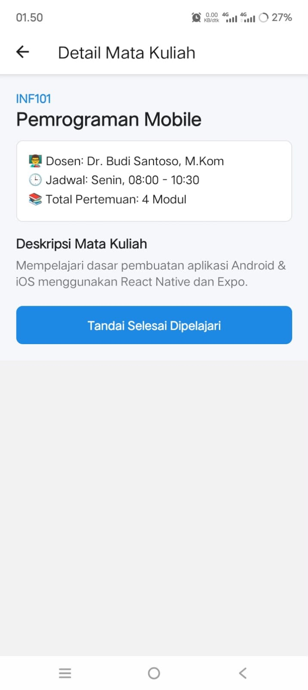
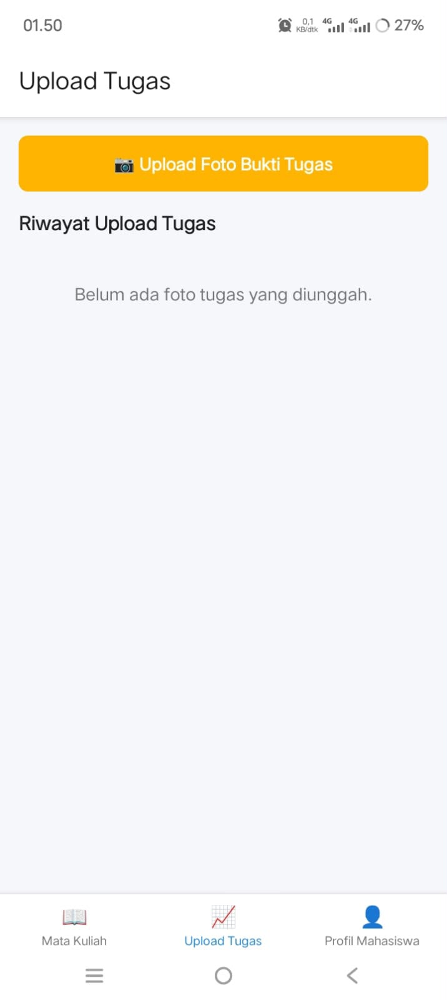
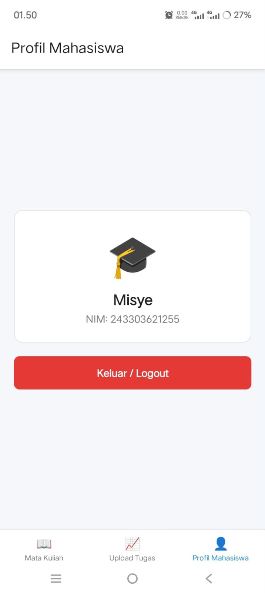

# UniLearn 🎓📚

Aplikasi mobile **E-Learning Kampus** berbasis React Native + Expo yang membantu mahasiswa mengakses daftar mata kuliah, melihat detail pembelajaran, menyimpan progress belajar, dan mengunggah bukti tugas secara lokal.

Project ini dibuat sebagai **Final Project UAS Praktikum Pemrograman Mobile** dengan implementasi navigasi, penyimpanan data lokal, device feature, dan build APK menggunakan EAS Build.

---

## 📱 Deskripsi Singkat

UniLearn adalah aplikasi pembelajaran online sederhana untuk mahasiswa.

Fitur utama aplikasi:
- Login mahasiswa menggunakan NIM dan nama
- Melihat daftar mata kuliah
- Melihat detail mata kuliah
- Menyimpan progress belajar menggunakan AsyncStorage
- Upload foto tugas menggunakan galeri perangkat
- Melihat profil mahasiswa dan logout

---

# ✨ Fitur Utama

| Fitur | Status |
|---|---|
| 🔐 Login mahasiswa dengan validasi form | ✅ |
| 💾 Penyimpanan user session dengan AsyncStorage | ✅ |
| 📚 Daftar mata kuliah menggunakan FlatList | ✅ |
| 📄 Detail mata kuliah menggunakan Stack Navigation | ✅ |
| 📈 Progress belajar tersimpan lokal | ✅ |
| 📷 Upload foto tugas menggunakan expo-image-picker | ✅ |
| 🗂️ Riwayat upload tugas tersimpan AsyncStorage | ✅ |
| 🔄 Bottom Tab Navigation | ✅ |
| ⏳ Loading state dan empty state | ✅ |

---

# 🍬 Coba Online (Expo Snack)

Mau mencoba aplikasi tanpa install APK terlebih dahulu?

Buka melalui Expo Snack:

**[▶️ Buka di Expo Snack](https://snack.expo.dev/@misyesinaga/b58cda)**

> Catatan: fitur upload gambar membutuhkan akses perangkat asli. Jalankan melalui Expo Go di HP untuk mencoba fitur device.

---

# 🛠️ Tech Stack

- **React Native** + **Expo SDK 54**
- **React Navigation v7**
  - Native Stack Navigator
  - Bottom Tab Navigator
- `@react-native-async-storage/async-storage`
  - penyimpanan data lokal
- `expo-image-picker`
  - upload foto tugas
- **EAS Build**
  - generate APK Android

---

# 📥 Cara Install APK

1. Download APK UniLearn dari link berikut:

**[⬇️ Download APK UniLearn](https://expo.dev/artifacts/eas/Nx91xP91h9g4HiAkM1VCrPzX_CGVmqiZovnSAUFwNdQ.apk)**

2. Buka file APK pada HP Android

3. Jika muncul izin instalasi dari sumber tidak dikenal, aktifkan izin tersebut

4. Tekan install dan buka aplikasi UniLearn

---

# 🚀 Menjalankan Project (Development)

Clone repository:

```bash
git clone https://github.com/misyesinaga1-alt/UniLearn-UAS.git

cd UniLearn-UAS

npm install

npx expo start
```

Scan QR Code menggunakan aplikasi **Expo Go**.

Untuk build APK sendiri:

```bash
eas build --platform android --profile preview
```

---

# 📸 Screenshot

## Halaman Login




## Halaman Beranda Mata Kuliah




## Detail Mata Kuliah




## Upload Foto Tugas




## Profil Mahasiswa



---

# 📦 EAS Build

Status build:

✅ Finished

Platform:

🤖 Android APK

Download:

https://expo.dev/artifacts/eas/Nx91xP91h9g4HiAkM1VCrPzX_CGVmqiZovnSAUFwNdQ.apk

---

# 🔗 Link Penting

- **Repository GitHub:**

https://github.com/misyesinaga1-alt/UniLearn-UAS


- **Download APK:**

https://expo.dev/artifacts/eas/Nx91xP91h9g4HiAkM1VCrPzX_CGVmqiZovnSAUFwNdQ.apk


- **Expo Snack:**

[LINK_EXPO_SNACK](https://snack.expo.dev/@misyesinaga/b58cda)


---

# 📂 Struktur Project

```
UniLearn
│
├── App.js
├── app.json
├── eas.json
├── package.json
│
├── src
│   ├── navigation
│   │   └── AppNavigator.js
│   │
│   ├── screens
│   │   ├── LoginScreen.js
│   │   ├── HomeScreen.js
│   │   ├── MatkulDetailScreen.js
│   │   ├── ProgresScreen.js
│   │   └── ProfileScreen.js
│   │
│   ├── components
│   │   ├── LoadingSpinner.js
│   │   └── EmptyState.js
│   │
│   ├── services
│   │   └── storage.js
│   │
│   └── constants
│       └── colors.js
```

---

# 👤 Author

**Misye Retno Wulansari Br Sinaga**

Final Project UAS Praktikum Pemrograman Mobile

Universitas Prima Indonesia  
Program Studi Sistem Informasi

Mata Kuliah:
**Pemrograman Mobile (TI-MOBILE-01)**
